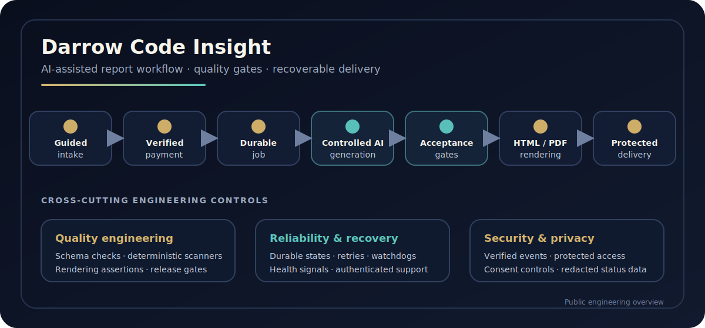

# Darrow Code Insight

[Live product](https://darrowcode.com/) · [Current product surfaces](docs/product-surfaces.md) · [Engineering portfolio](https://dmytropogribnyy.github.io/)

Darrow Code Insight is a full-stack AI-assisted report product that turns guided customer input into a validated, professionally rendered digital report. It coordinates intake, checkout, controlled content generation, HTML/PDF rendering, protected access, and delivery as one recoverable workflow.

The current catalog covers birth-chart reports, focused chapters, personal timing, auspicious-date selection, and private Tarot reflection. The engineering challenge is broader than text generation: every paid order must move safely through data preparation, quality gates, document production, storage, and customer delivery.

> This repository contains the public product and engineering overview. Detailed implementation and operational configuration are maintained in a private engineering repository.

## Current live product

  

The current homepage leads with **“Your zodiac sign is only the surface.”** The first product block offers **CORE**, **CORE Complete**, and six focused chapters: LOVE, MONEY, BODY, YEAR, STYLE, and PLACE.

  
  

The broader product line also includes Continuum timing reports, Almanac best-date selection, and Tarot Mirror. See the [current product-surface overview](docs/product-surfaces.md).

## At a glance

| Area | Scope |
| --- | --- |
| Product | Guided purchase and delivery of personalized digital reports |
| Core workflow | Intake → verified payment → durable generation → validation → HTML/PDF → protected delivery |
| Product families | CORE reports, focused chapters, Continuum, Almanac, and Tarot Mirror |
| Engineering focus | Quality gates, recoverable background work, secure access, observability, and release confidence |
| Ownership | Independently designed and engineered end to end |

## Product workflow

## Customer journey

1. A customer selects a report and completes a guided intake.
2. Submitted data is validated and prepared for processing.
3. Verified checkout establishes the paid order.
4. Durable background work assembles context and performs controlled AI-assisted generation.
5. Acceptance checks evaluate structure, completeness, and content constraints.
6. Approved content is rendered as a web experience and downloadable PDF.
7. The report is exposed through protected access and delivered by email.

Returning customers can access account flows, while authenticated administration supports order, report, support, subscription, and system operations.

## Product capabilities

- Guided product selection and structured data collection
- Payment-aware order and report orchestration
- Controlled AI-assisted generation from prepared context
- Schema, content, and acceptance validation before rendering
- Branded HTML and PDF report output
- Protected result access, download, and email delivery
- Customer account and authenticated administration workflows
- Consent-aware analytics and marketing behavior
- Background processing, retry limits, recovery paths, health signals, and alerting

## Verification snapshot

A full local verification run of the audited product tree on 23 July 2026 produced:

| Check | Result |
| --- | --- |
| Automated tests | **1,264 passed**, 22 skipped |
| Test files | **154 passed**, 1 skipped |
| Public documentation workflow | Passing |
| Public/private repository separation | Verified |

The snapshot records an actual completed run rather than an estimated coverage claim. Test totals will evolve with the private product implementation.

## What this repository demonstrates

- **Transactional workflow design** — payment, generation, rendering, storage, and delivery are modeled as explicit states rather than a single long request.
- **AI output quality engineering** — generated content is treated as an untrusted artifact that must pass deterministic and report-specific acceptance checks.
- **Release confidence** — automated tests, type checks, linting, formatting, build validation, and targeted diagnostics cover critical product boundaries.
- **Operational resilience** — queued, stuck, failed, and incomplete work can be identified and recovered without creating a second purchase.
- **Privacy-aware delivery** — protected report access, server-side authorization, consent controls, and redacted public status surfaces are part of the product design.

## Why reliability matters

A personalized paid report crosses several independent boundaries: customer input, payment confirmation, data preparation, generation, validation, rendering, storage, and delivery. Treating these as disconnected integrations would make partial failure difficult to detect and recover from.

Darrow Code Insight models the journey as an explicit pipeline. Paid work is represented as durable background jobs, validation gates prevent rejected content from advancing, and recovery logic distinguishes queued, stuck, failed, and incomplete delivery states.

Read the [report-generation reliability case study](case-studies/report-generation-reliability.md).

## Architecture and quality

The product uses a TypeScript and React stack with TanStack Start and Vite. Server-side workflows coordinate Stripe checkout, Supabase-backed application services, controlled provider access, AI-assisted generation, and browser-based PDF rendering for a Cloudflare-oriented runtime.

Quality engineering covers:

- generation decisions and report-module contracts;
- structured output and acceptance rules;
- provider throttling, timeouts, retries, and cost controls;
- payment-event and delivery safety;
- PDF layout and rendering behavior;
- consent, security helpers, administrative operations, and recovery selection;
- linting, formatting, type checking, automated tests, build verification, and targeted diagnostics.

See [Architecture and quality](docs/architecture-and-quality.md) for the system view and [AI output quality controls](case-studies/ai-output-quality-controls.md) for a focused case study.

## Selected production code

The public repository includes one intentionally selected implementation excerpt: [stale deployment chunk recovery](examples/stale-chunk-recovery.ts). It detects dynamic-import failures after a deployment, performs a guarded browser reload, and prevents reload loops with a session cooldown.

This small excerpt demonstrates the production approach without exposing proprietary generation, payment, data, or operational logic. See [Public engineering excerpts](examples/README.md).

## Security and privacy

Payment events are verified before order-state changes. Sensitive operations use server-side authorization, protected report access, redirect safety checks, bot protection, secret-hygiene controls, and explicit test-mode boundaries. Analytics activation follows consent state.

Public-facing status and product documentation avoid customer data and operational secrets. See the [security policy](SECURITY.md) for responsible disclosure guidance.

## Technology

- TypeScript, React, TanStack Start, TanStack Router, and Vite
- Zod and React Hook Form for typed validation and guided input
- Supabase for application data, authentication, storage, and scheduled work
- Stripe for checkout and verified payment events
- Cloudflare runtime services and browser rendering
- HTML, browser-based rendering, and PDF tooling
- Vitest, ESLint, Prettier, and TypeScript release checks

## Engineering ownership

Darrow Code Insight is independently designed and engineered as a complete product. Ownership spans product architecture, implementation, automated testing, AI quality controls, report rendering, payment and delivery coordination, reliability and recovery, release validation, deployment preparation, and operational readiness.

Engineering by [Dmytro Pogribnyy](https://dmytropogribnyy.github.io/).

## Repository contents

- [Current product surfaces](docs/product-surfaces.md)
- [Architecture and quality](docs/architecture-and-quality.md)
- [Report-generation reliability](case-studies/report-generation-reliability.md)
- [AI output quality controls](case-studies/ai-output-quality-controls.md)
- [Public engineering excerpts](examples/README.md)
- [Security policy](SECURITY.md)
- [Visual assets and publication policy](assets/README.md)
