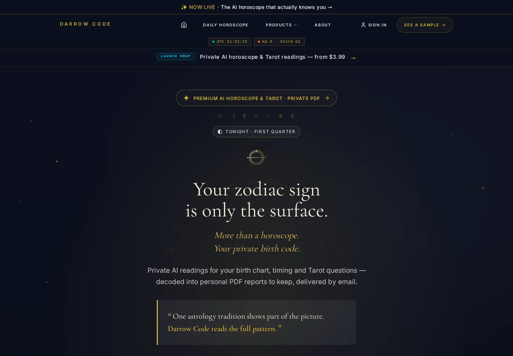

# Darrow Code Insight

[Live product](https://darrowcode.com/) · [Product walkthrough](assets/product/current-site-walkthrough.mp4) · [Architecture & quality](docs/architecture-and-quality.md) · [Engineering portfolio](https://dmytropogribnyy.github.io/)

  

**Darrow Code Insight** is a production AI-assisted digital-report product that turns structured customer input into private, professionally rendered PDF readings. The platform combines product design, guided intake, verified checkout, controlled AI generation, deterministic quality gates, document rendering, protected access, and email delivery in one recoverable workflow.

> This repository is the public product and engineering showcase for a real independently developed product. Production source code, customer data, secrets, prompts, and operational configuration remain private.

## Product walkthrough

The walkthrough is a real browser capture of the current public product: homepage, product positioning, report selection, and the transition into the CORE product family. No login, checkout, customer information, or internal tooling is shown.

## Product at a glance

| Area | Current scope |
| --- | --- |
| Product | Private AI-assisted astrology, timing, and Tarot reports delivered as PDFs |
| Product families | CORE, CORE Complete, six focused chapters, Continuum, Almanac, Tarot Mirror |
| Core workflow | Intake → verified payment → durable generation → validation → HTML/PDF → protected delivery |
| Engineering focus | AI output quality, transactional reliability, recovery, privacy, observability, and release confidence |
| Ownership | Product design, full-stack engineering, QA automation, delivery architecture, and operational readiness |

## Current product experience

<table>
  <tr>
    <td width="72%" valign="top">
      
    </td>
    <td width="28%" valign="top">
      
    </td>
  </tr>
</table>

The current catalog supports several distinct customer journeys:

- **CORE** — the foundational personal birth-chart report.
- **CORE Complete** — CORE plus LOVE, MONEY, BODY, YEAR, STYLE, and PLACE as separate private PDFs.
- **Continuum** — personal 7-day and 30-day timing reports, including recurring delivery options.
- **Almanac** — a personal best-date report for selected activities and timeframes.
- **Tarot Mirror** — a private three-card symbolic reflection for one clear question.

See [Current product surfaces](docs/product-surfaces.md) for capture provenance and a focused visual review.

## What I built

| Capability | Engineering responsibility |
| --- | --- |
| Product UX | Responsive storefront, modular report selection, guided intake, samples, consent-aware customer flows |
| Transactional backend | Payment-aware order creation, verified event handling, durable background processing, idempotent recovery |
| AI quality layer | Structured context assembly, schema validation, forbidden-claim checks, report-specific acceptance gates |
| Document delivery | Branded HTML/PDF rendering, protected report access, download and email delivery |
| Reliability | Timeouts, bounded retries, circuit breakers, stuck-work detection, replay-safe recovery paths |
| Quality engineering | Automated tests, type checks, linting, formatting, build validation, diagnostics, browser and PDF checks |
| Security & privacy | Server-side authorization, protected assets, secret hygiene, bot protection, consent-controlled analytics |

## End-to-end workflow

1. A customer selects a report and completes a structured intake.
2. Inputs are validated and normalized before transactional processing.
3. Verified checkout establishes the paid order.
4. Durable background work assembles context and performs controlled AI-assisted generation.
5. Deterministic and report-specific acceptance checks evaluate the generated artifact.
6. Approved content is rendered as a branded web experience and downloadable PDF.
7. Protected access is created and the report is delivered by email.
8. Failed or incomplete work can be inspected and recovered without creating a duplicate purchase.

## Engineering evidence

A full local verification run of the audited production tree on **23 July 2026** completed with:

| Check | Result |
| --- | --- |
| Automated tests | **1,264 passed**, 22 skipped |
| Test files | **154 passed**, 1 skipped |
| Public documentation workflow | Passing |
| Public/private repository boundary | Verified |

This is a dated verification snapshot, not a permanent coverage claim; the private production implementation continues to evolve.

### Quality model

- **Generated content is untrusted by default.** It must pass structural, semantic, safety, and product-specific checks before rendering.
- **Paid work is durable.** Generation is not treated as one fragile request; explicit states make partial failure visible and recoverable.
- **Retries are bounded and idempotent.** Recovery avoids duplicate reports, duplicate delivery, and duplicate purchase side effects.
- **Release gates cover product boundaries.** Tests exercise generation decisions, validation contracts, payment safety, delivery, rendering, consent, and recovery behavior.
- **Public evidence is deliberately scoped.** This repository demonstrates the system without exposing proprietary prompts, private schemas, credentials, or customer records.

Read the focused case studies:

- [Report-generation reliability](case-studies/report-generation-reliability.md)
- [AI output quality controls](case-studies/ai-output-quality-controls.md)

## Architecture and technology

The product uses a TypeScript and React stack with TanStack Start, TanStack Router, and Vite. Server-side workflows coordinate Stripe checkout, Supabase-backed application services, controlled model-provider access, background processing, and browser-based PDF rendering for a Cloudflare-oriented runtime.

**Core technologies:**

- TypeScript, React, TanStack Start, TanStack Router, Vite
- Zod and React Hook Form for typed validation and guided input
- Supabase for application data, authentication, storage, and scheduled work
- Stripe for checkout and verified payment events
- Cloudflare runtime services and browser rendering
- HTML/PDF generation and delivery tooling
- Vitest, ESLint, Prettier, TypeScript, Playwright, and targeted diagnostics

See [Architecture and quality](docs/architecture-and-quality.md) for the system-level view.

## Selected production-safe code

The public repository includes one deliberately selected implementation excerpt: [stale deployment chunk recovery](examples/stale-chunk-recovery.ts). It detects dynamic-import failures after a deployment, performs a guarded reload, and prevents reload loops with a session cooldown.

The excerpt demonstrates production hardening without disclosing proprietary generation, payment, data, or operational logic. See [Public engineering excerpts](examples/README.md).

## Security and privacy

Payment events are verified before order-state changes. Sensitive operations use server-side authorization, protected report access, redirect safety checks, bot protection, explicit test-mode boundaries, and secret-hygiene controls. Optional analytics activate only after consent.

See [Security policy](SECURITY.md) for responsible disclosure guidance.

## Repository map

- [Current product surfaces](docs/product-surfaces.md)
- [Architecture and quality](docs/architecture-and-quality.md)
- [Report-generation reliability](case-studies/report-generation-reliability.md)
- [AI output quality controls](case-studies/ai-output-quality-controls.md)
- [Public engineering excerpts](examples/README.md)
- [Visual asset provenance](assets/README.md)
- [Security policy](SECURITY.md)

## Engineering ownership

Darrow Code Insight is independently designed and engineered end to end by [Dmytro Pogribnyy](https://dmytropogribnyy.github.io/), covering product architecture, implementation, automated testing, AI quality controls, report rendering, payment and delivery coordination, reliability, release validation, deployment preparation, and operational readiness.
