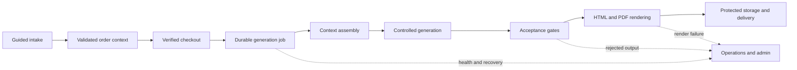

# Architecture and quality

## System overview

Darrow Code Insight coordinates a transactional report workflow around a TypeScript web application. The browser experience handles product selection, guided intake, checkout, report status, protected downloads, account access, and administrative operations. Server-side workflows own payment verification, durable job processing, data-provider access, AI-assisted generation, document rendering, storage, and delivery.

## Application boundaries

The product separates customer-facing routes from authenticated account and administration areas. Server-side modules isolate payment, generation, delivery, observability, security, and rendering responsibilities. External services are accessed through controlled server boundaries rather than directly from the customer interface.

The high-level platform includes:

- React and TanStack Start for the full-stack product experience
- Typed validation for intake and generated structures
- Supabase-backed authentication, persistence, storage, and scheduled work
- Stripe checkout and verified payment-event handling
- Controlled AI-assisted content generation
- Cloudflare-oriented runtime and browser-based PDF rendering

## Quality model

Quality controls are placed at the boundaries where a customer-visible failure or inconsistent paid-order state could occur.

| Boundary | Risk being controlled | Representative control | Verification focus |
| --- | --- | --- | --- |
| Intake | Incomplete or malformed customer data | Typed schemas and guided validation | Validation and route-contract tests |
| Payment | Work starting without a verified purchase | Verified payment events and explicit order-state transitions | Payment-safety and workflow tests |
| Generation | Structurally invalid, unsafe, or off-voice content | Structured context, schema validation, deterministic scans, and report-specific acceptance | Scanner, acceptance, orchestration, and failure-path tests |
| Rendering | Missing sections, layout drift, or unusable PDFs | Browser-based rendering, templates, page budgets, and render assertions | Template, page-layout, and rerender tests |
| Delivery | A completed artifact not reaching the customer | Durable report state, protected access, email assembly, and delivery recovery | Delivery, access, email, and recovery tests |
| Operations | Stuck or failed work remaining invisible | Structured stage logs, health signals, alerts, watchdog logic, and authenticated support actions | Health, diagnostics, selection, and support tests |
| Deployment | An open browser requests a replaced JavaScript chunk after release | Guarded stale-chunk detection and one-time reload | Browser-event and reload-loop safeguards |

## Generation quality controls

Generation begins with structured context rather than an unconstrained request. Report-specific acceptance modules check required shape and content before rendering. Confirmed safeguards include schema validation, content and voice rules, forbidden-claim scanning, technical-density checks, provider rate gates, timeouts, circuit breaking, retry budgets, and order-level cost controls.

Deterministic scanners complement model instructions. They can reject unsupported claims, detect overly technical prose, verify that supporting tags are backed by prepared context, and enforce product-specific wording constraints. Generated output is therefore treated as an untrusted artifact until it passes the relevant acceptance path.

These controls are designed to fail closed at important boundaries: a payment must be established before paid work proceeds, invalid generated content is not treated as an approved report, and a rendering or delivery failure does not silently become a completed order.

Read the [AI output quality controls case study](../case-studies/ai-output-quality-controls.md).

## Document rendering

Approved report data is assembled into branded HTML and converted to PDF through a browser-rendering pipeline. Automated checks cover templates, page budgets, blank-page pruning, page numbering, layout details, and rerendering from retained report data. The result is both a digital reading experience and a downloadable document.

## Reliability and observability

Report generation runs as durable background work, with the payment request providing an initial dispatch and scheduled processing acting as a recovery path. The implementation distinguishes queued, processing, failed, stuck, and orphaned work so eligible jobs can be selected for retry or recovery.

Operational controls include structured stage logs, a public-facing status response without personal data, alert conditions, throttled notifications, report watchdog logic, and authenticated support actions. Recovery can resume generation or delivery without creating a second purchase.

The browser layer also handles a narrow deployment failure mode: an already-open tab can request a content-hashed chunk that was replaced by a new release. The public [stale-chunk recovery excerpt](../examples/stale-chunk-recovery.ts) is a safety-hardened standalone adaptation of the mechanism used for that case.

Read the [report-generation reliability case study](../case-studies/report-generation-reliability.md).

## Security and privacy

The application verifies payment events, protects server operations, checks safe redirects, guards report access, and separates test behavior from normal payment flow. Bot protection is present on exposed interactions. Secret access is centralized and covered by hygiene tests.

Consent state governs analytics activation. The product also includes privacy, terms, newsletter subscription, and unsubscribe flows. Public documentation intentionally excludes schemas, endpoints, prompts, credentials, environment values, provider routing, and operational runbooks.

## Verification strategy

The engineering suite uses Vitest across report generation, acceptance rules, AI usage controls, provider behavior, payment safety, delivery, email assembly, PDF rendering, consent, administration, security helpers, health tooling, and recovery decisions.

Verification is layered rather than concentrated in a single end-to-end path:

1. Pure validation and scanner tests exercise deterministic rules quickly.
2. Module and contract tests cover report assembly, payment decisions, delivery, and recovery selection.
3. Rendering tests inspect templates, page behavior, and reusable artifacts.
4. Workflow diagnostics exercise critical integration paths and operational recovery.
5. ESLint, Prettier, TypeScript checks, build validation, and targeted commands support release readiness.

A full local verification run of the audited product tree on 23 July 2026 completed with 154 test files passed, 1 skipped, 1,264 tests passed, and 22 skipped. This is a dated execution snapshot, not a permanent coverage promise.

This public repository adds a secret-free documentation workflow that checks basic Markdown structure and internal relative links. It does not deploy, access product infrastructure, or call any provider.
