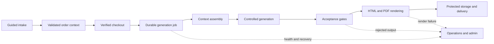

# Architecture and quality

## System overview

Darrow Code Insight coordinates a transactional report workflow around a TypeScript web application. The browser experience handles product selection, guided intake, checkout, report status, protected downloads, account access, and administrative operations. Server-side workflows own payment verification, durable job processing, data-provider access, AI-assisted generation, document rendering, storage, and delivery.

## Application boundaries

The product separates customer-facing routes from authenticated account and administration areas. Server-side modules isolate payment, generation, delivery, observability, security, and rendering responsibilities. External services are accessed through controlled server boundaries rather than directly from the customer interface.

The high-level platform includes:

- React and TanStack Start for the full-stack product experience
- Typed validation for intake and generated structures
- Supabase-backed authentication, persistence, storage, and scheduled work
- Stripe checkout and verified payment-event handling
- Controlled AI-assisted content generation
- Cloudflare-oriented runtime and browser-based PDF rendering

## Generation quality controls

Generation begins with structured context rather than an unconstrained request. Report-specific acceptance modules check required shape and content before rendering. Confirmed safeguards include schema validation, content and voice rules, forbidden-claim scanning, technical-density checks, provider rate gates, timeouts, circuit breaking, retry budgets, and order-level cost controls.

These controls are designed to fail closed at important boundaries: a payment must be established before paid work proceeds, invalid generated content is not treated as an approved report, and a rendering or delivery failure does not silently become a completed order.

## Document rendering

Approved report data is assembled into branded HTML and converted to PDF through a browser-rendering pipeline. Automated checks cover templates, page budgets, blank-page pruning, page numbering, layout details, and rerendering from retained report data. The result is both a digital reading experience and a downloadable document.

## Reliability and observability

Report generation runs as durable background work, with the payment request providing an initial dispatch and scheduled processing acting as a recovery path. The implementation distinguishes queued, processing, failed, stuck, and orphaned work so eligible jobs can be selected for retry or recovery.

Operational controls include structured stage logs, a public health response without personal data, alert conditions, throttled notifications, report watchdog logic, and authenticated support actions. Recovery can resume generation or delivery without creating a second purchase.

## Security and privacy

The application verifies payment events, protects server operations, checks safe redirects, guards report access, and separates test behavior from normal payment flow. Bot protection is present on exposed interactions. Secret access is centralized and covered by hygiene tests.

Consent state governs analytics activation. The product also includes privacy, terms, newsletter subscription, and unsubscribe flows. Public documentation intentionally excludes schemas, endpoints, prompts, credentials, environment values, provider routing, and operational runbooks.

## Verification strategy

The engineering suite uses Vitest across report generation, acceptance rules, AI usage controls, provider behavior, payment safety, delivery, email assembly, PDF rendering, consent, administration, security helpers, health tooling, and recovery decisions. ESLint, Prettier, TypeScript checks, build validation, and targeted diagnostic commands support release readiness.

This public repository adds a secret-free documentation workflow that checks basic Markdown structure and internal relative links. It does not deploy, access product infrastructure, or call any provider.
