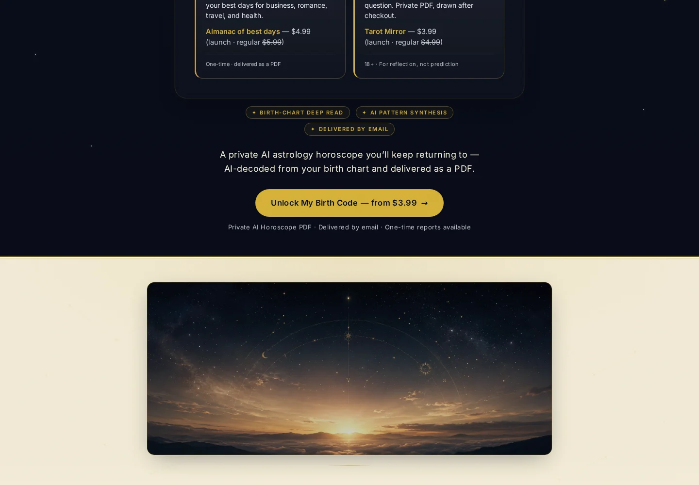
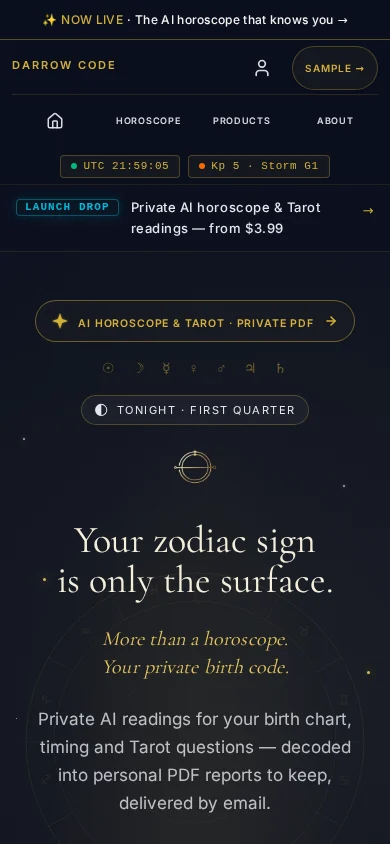

# Current product surfaces

This page documents real captures of the current public Darrow Code product, verified on **23 July 2026** against the live site and the active Lovable project state.

No customer records, birth details, email addresses, account identifiers, payment information, internal URLs, or operational diagnostics are present in these captures.

## Desktop homepage

The public experience leads with the current navigation, promotional messaging, and the headline **“Your zodiac sign is only the surface.”** It positions Darrow Code as private AI-assisted astrology, timing, and Tarot readings delivered as personal PDF reports.

  

## Product selection

The current report selector presents CORE and CORE Complete first, followed by six focused chapters. Pricing and bundle presentation are shown exactly as rendered on the public site at capture time.

  

Current birth-chart report family:

- **CORE** — foundational personal report
- **CORE Complete** — CORE plus all six focused chapters
- **LOVE** — relationship and attraction patterns
- **MONEY** — work, earning, and value patterns
- **BODY** — stress signature and recovery rhythm
- **YEAR** — personal timing and opportunity patterns
- **STYLE** — aesthetic signature and presence
- **PLACE** — environment and location patterns

Additional current product journeys include Continuum timing reports, Almanac best-date selection, and Tarot Mirror.

## Mobile experience

The responsive mobile layout preserves the product identity, hierarchy, messaging, and primary navigation in a compact viewport.

  

## Walkthrough video

▶ **[Watch the current product walkthrough (MP4)](../assets/product/current-site-walkthrough.mp4)**

The walkthrough is a silent Playwright browser recording of the public homepage and product-selection journey. It does not enter checkout, authentication, forms, customer records, or administration.

## Capture provenance

| Asset | Source | Capture profile |
| --- | --- | --- |
| `current-home-hero.webp` | Live public homepage | Desktop, 1440 × 1000 |
| `current-product-selector.webp` | Live public homepage | Desktop, focused report-selection viewport |
| `current-home-mobile.webp` | Live public homepage | Mobile, 390 × 844 |
| `current-site-walkthrough.mp4` | Live public homepage | Playwright browser recording, optimized with FFmpeg |

## What these surfaces demonstrate

- A complete customer-facing product rather than an engineering-only prototype
- Responsive product design across desktop and mobile
- A modular catalog with foundation, focused, timing, calendar, and Tarot journeys
- Finished paid PDF products rather than raw AI chat output
- Clear commercial hierarchy, product packaging, sample access, and delivery expectations
- Separation between public product presentation and the private transactional implementation

The live site remains the source of truth. Captures are refreshed only after visual verification against the current published experience.
